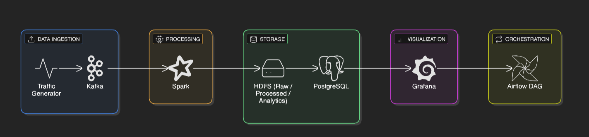
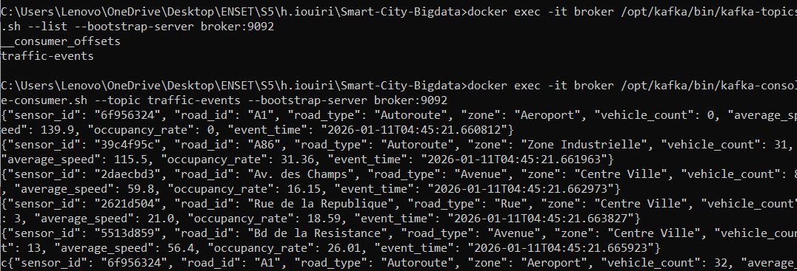

# 🚦 Smart City Big Data Traffic Pipeline

End-to-End Big Data pipeline for Smart City traffic monitoring and mobility analytics using Kafka, HDFS, Spark, PostgreSQL, Grafana, and Airflow.

---

## 📌 Project Context

Modern Smart Cities rely on continuous traffic data to:

- Monitor congestion
- Analyze vehicle flow
- Improve urban mobility
- Support decision-making

This project implements a complete real-time Big Data pipeline simulating Smart City traffic sensors.

---

## 🏗️ Architecture



---

## 🔁 Pipeline Flow

Traffic Generator → Kafka → HDFS → Spark → Parquet → PostgreSQL → Grafana → Airflow

---

## 📂 Project Structure

```
Smart-City-Bigdata/
│
├── generator/        # Traffic data generator
├── kafka/            # Kafka producer & configs
├── spark/            # Spark processing scripts
├── airflow/          # Airflow DAGs
├── grafana/          # Grafana dashboards
├── screenshots/      # Screenshots for report
├── docker-compose.yml
└── README.md
```

---

## 🧪 Steps

### Step 1 — Data Collection
Simulated traffic sensor generator producing JSON events.


---

### Step 2 — Data Ingestion
Kafka streaming ingestion using topic `traffic-events`.




---

### Step 3 — Raw Data Storage
Kafka consumer writes data into HDFS raw zone.

---

### Step 4 — Data Processing
Spark computes:
- Average traffic per zone
- Average speed per road
- Congestion rate

---

### Step 5 — Analytics Zone
Processed data stored in Parquet format.

---

### Step 6 — Visualization
Grafana dashboards show:
- Global Mobility Summary:


- Critical zones:


---

### Step 7 — Orchestration
Airflow DAG automates the pipeline.


---

## 📊 KPIs

- Vehicle count average
- Occupancy rate
- Congestion rate
- Speed category

---

## ⚙️ Technologies

| Tool | Role |
|------|------|
| Kafka | Streaming ingestion |
| HDFS | Data Lake |
| Spark | Processing |
| PostgreSQL | Analytics DB |
| Grafana | Visualization |
| Airflow | Orchestration |
| Docker | Containerization |

---

## 📈 Business Value

This pipeline allows:

- Real-time traffic supervision
- Congestion detection
- Mobility optimization
- Decision support

---

## 👨‍💻 Author

[HANANE IOUIRI]

Data Engineering Student – Smart City Big Data Project

---

## ✅ Conclusion

This project demonstrates a complete Big Data architecture for Smart City mobility analytics from sensor simulation to decision dashboards.

